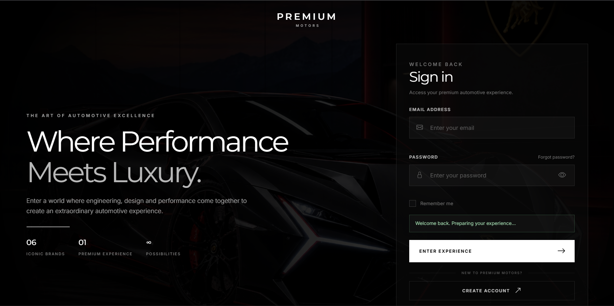
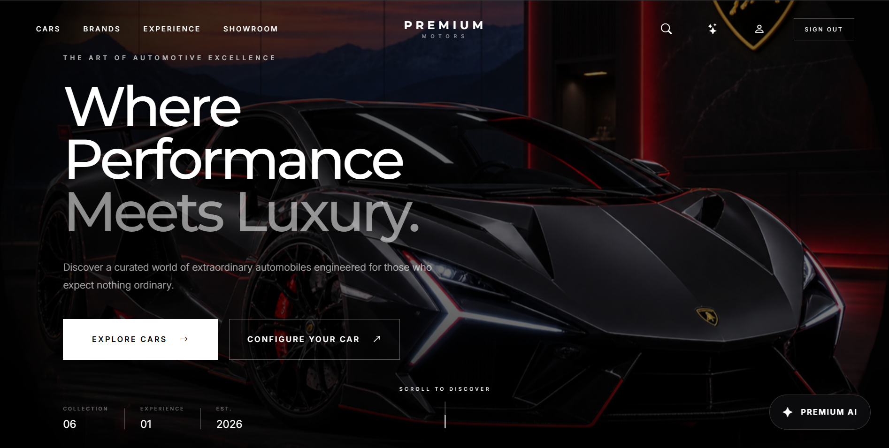
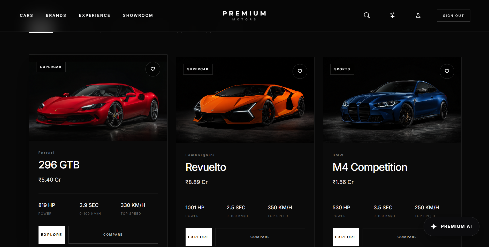
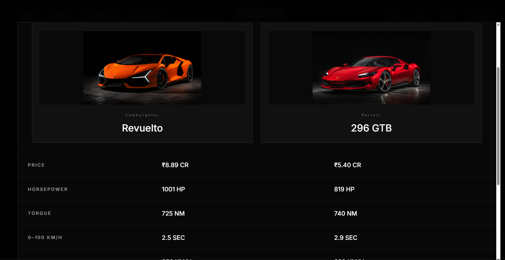

# 🚗 Premium Motors — Car Showroom & Comparison Web

A responsive, front-end luxury car showroom website where users can create an account, log in, browse premium cars, compare models side by side, customize a vehicle, save favorites, and ask a built-in automotive assistant questions.

Built entirely with **HTML, CSS, JavaScript and Bootstrap** — no backend required.

<p>
  
  
  
  
</p>

## 🔗 Live Demo

**👉 [View the live website](https://shivam2713.github.io/Car-Showroom/)**


## 📸 Screenshots

| Login Page | Home Page |
|---|---|
|  |  |

| Showroom | Car Comparison |
|---|---|
|  |  |


## ✨ Features

### 🔐 User Authentication (client-side)
- Create account page with form validation
- Login with email validation and error/success messages
- Show / hide password toggle
- "Remember me" option
- Forgot password flow
- Session handling and logout
- Protected pages that check login state

### 🏎️ Car Showroom
- Premium landing page with hero section
- Car collection featuring models from **Audi, BMW, Ferrari, Lamborghini, Mercedes-AMG and Porsche**
- Search and filter cars
- Detailed car information view
- Brand showcase section

### ⚖️ Car Comparison
- Add multiple cars to a comparison
- Side-by-side specification comparison
- Clear and close comparison options

### 🎨 Vehicle Configurator
- Choose colors and options for a model
- Price updates automatically based on selected options

### ❤️ Personalization
- Add or remove cars from **Favorites**
- **Recently Viewed** cars list
- Data saved in the browser using `localStorage`
- Profile page for the logged-in user

### 🤖 Automotive Assistant
- Built-in chat assistant that answers questions about the available cars
- Typing indicator and chat-style interface

### 📱 Responsive Design
- Works on mobile, tablet and desktop
- Mobile navigation menu
- Premium notifications for user actions

## 🛠️ Technologies Used

| Technology | Purpose |
|---|---|
| **HTML5** | Page structure and semantic markup |
| **CSS3** | Custom styling, layout and responsive design |
| **JavaScript (ES6)** | Interactivity, validation, filtering, comparison, configurator, `localStorage` |
| **Bootstrap 5.3** | Responsive grid and UI components |
| **Bootstrap Icons** | Icons across the site |
| **Google Fonts** | Inter and Montserrat typography |

## 📁 Project Structure

```
car-showroom/
├── index.html            # Login page (entry point)
├── pages/
│   ├── register.html     # Create account page
│   ├── showroom.html     # Showroom page
│   ├── home.html         # Main home page: cars, comparison, configurator, assistant
│   └── profile.html      # User profile page
├── css/
│   └── style.css         # Main stylesheet
├── js/
│   └── script.js         # All site logic
├── assets/
│   ├── images/           # Car images and brand logos
│   └── hero-car.png      # Hero image
└── README.md
```

## ▶️ How to Run Locally

No installation or build step is needed.

1. **Clone** the repository
   ```bash
   git clone https://github.com/YOUR-USERNAME/car-showroom.git
   ```
2. **Open the folder**
   ```bash
   cd car-showroom
   ```
3. **Open `index.html`** in your browser (double-click it, or use the *Live Server* extension in VS Code).

> An internet connection is needed to load Bootstrap, Bootstrap Icons and Google Fonts from their CDNs.

## 🚀 Deployment

This project is a static website and is hosted using **GitHub Pages**.

1. Push the project to a GitHub repository
2. Go to **Settings → Pages**
3. Select branch **main** and folder **/ (root)**, then save
4. The site goes live at `https://shivam2713.github.io/Car-Showroom/`

## ⚠️ Important Notes

- This is a **front-end demonstration project**. Account data is stored in the browser's `localStorage` only, so there is no real server or database. **Do not enter real passwords.**
- Car images and brand names are used for **educational and portfolio purposes only**. All trademarks belong to their respective owners.

## 🔮 Future Improvements

- Connect a backend (Node.js / Firebase) for real authentication
- Store users and cars in a database
- Add a real booking system for test drives
- Connect the assistant to an AI API
- Add more brands and car models

## 👨‍💻 Author

**Shivam**
Diploma Student — Computer Engineering
DKTE Society's Yashwantrao Chavan Polytechnic, Ichalkaranji

- 💼 LinkedIn: (https://www.linkedin.com/in/shivam-jadhav-987911299?utm_source=share_via&utm_content=profile&utm_medium=member_android)
- 🐙 GitHub: (https://github.com/@SHIVAM2713)
- 📧 Email: shivamdeepakjadhav@gmail.com

---

⭐ If you like this project, please give it a star on GitHub!
